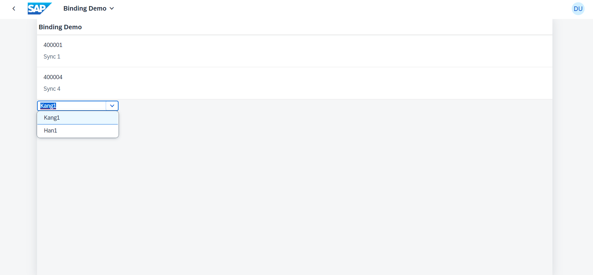

## Application Details
|               |
| ------------- |
|**Generation Date and Time**<br>Mon Mar 11 2024 07:58:04 GMT+0000 (Coordinated Universal Time)|
|**App Generator**<br>@sap/generator-fiori-freestyle|
|**App Generator Version**<br>1.12.5|
|**Generation Platform**<br>SAP Business Application Studio|
|**Template Used**<br>simple|
|**Service Type**<br>None|
|**Service URL**<br>N/A
|**Module Name**<br>zfc1742|
|**Application Title**<br>Binding Demo|
|**Namespace**<br>sync4|
|**UI5 Theme**<br>sap_horizon|
|**UI5 Version**<br>1.121.1|
|**Enable Code Assist Libraries**<br>False|
|**Enable TypeScript**<br>False|
|**Add Eslint configuration**<br>False|

## zfc1742

학급 List를 선택하면 ComboBox의 Item이 선택된 학급의 학생데이터가 보여지며 선택할 수 있습니다.

### 실행화면


### Starting the generated app

-   This app has been generated using the SAP Fiori tools - App Generator, as part of the SAP Fiori tools suite.  In order to launch the generated app, simply run the following from the generated app root folder:

```
    npm start
```

#### Pre-requisites:

1. Active NodeJS LTS (Long Term Support) version and associated supported NPM version.  (See https://nodejs.org)


